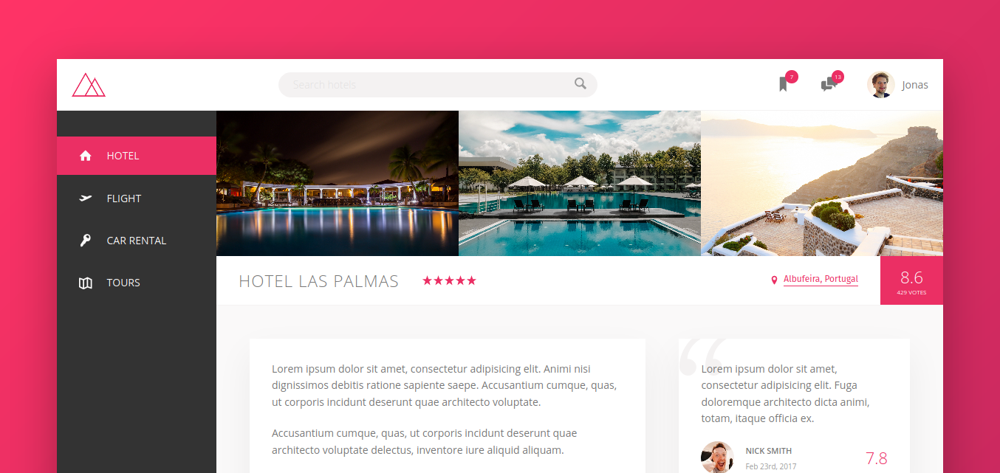

# Trillo

Trillo would be a web application that help users find the best hotels bedrooms,
flight, rental car and tours around world in best price.
The project it's result of studies about flexbox layout for Advanced CSS and
SASS course produced by Jonas Schmedtmann.

## About Advanced CSS and SASS course:
It's a course focused to teach advance and modern ways to develop CSS using 
SASS as CSS preprocessor.

## About FlexBox Layout

Flexbox Layout is a CSS Layout Module for unidimensional user interface
development. Its properties is:

* Flex Container Properties
  - `display` *with value* `flex`
  - `flex-direction`
  - `flex-wrap`
  - `align-content`
  - `align-items`
  - `justify-content`
  - `flex-flow` *a shorthand property to use* `flex-direction` and `flex-wrap`

* Flex Item Properties
  - `order`
  - `flex-grow`
  - `flex-shrink`
  - `flex-basis`
  - `align-self`
  - `flex` *a shorthand property to use* `flex-grow`, `flex-shrink` and `flex-basis`
